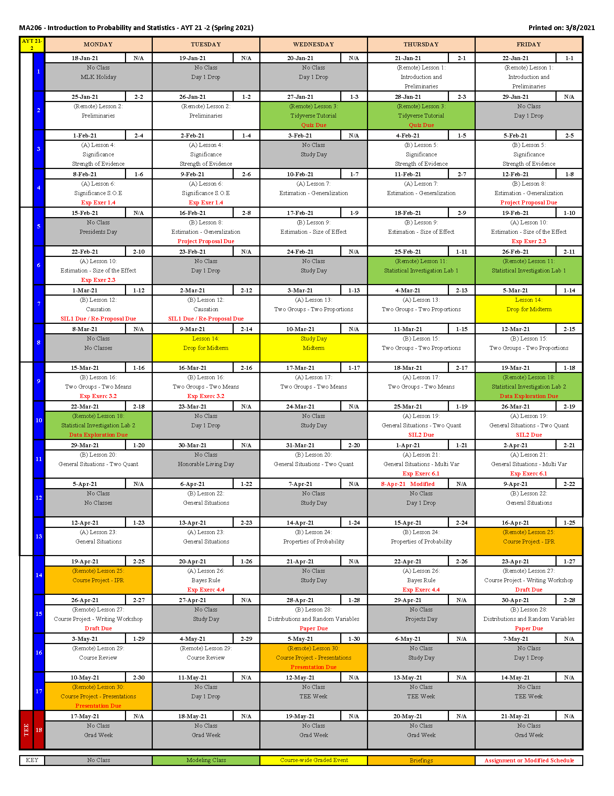

```{r klippy, echo=FALSE, include=TRUE, warning=F}
klippy::klippy()
```

```{r knitr_init, echo=FALSE, cache=FALSE, warning=F}
library(knitr)
library(rmdformats)

## Global options
options(max.print="75")
opts_chunk$set(echo=TRUE,
	             cache=TRUE,
               prompt=FALSE,
               tidy=TRUE,
               comment=NA,
               message=FALSE,
               warning=FALSE)
opts_knit$set(width=75)

set.seed(1)
```

***

<center></center>

*** 

Visit the course <a href="https://usma.blackboard.com/" target="_blank"> Blackboard page </a>  to find more resources for the course.

***
# Welcome

***
## Why Study Data Analysis and Statistics

How does sleep affect my performance on the athletic field? Does drinking coffee improve my WPR grades?  How accurately can we predict the score of the Army/Navy football game?  Every day, we encounter questions, like these, for which data provides important insights.  Scientists, corporations, governments, political parties, professional sports teams, and militaries ask similar questions.  In an age where almost everything is connected to the internet, we can inform more and more of these questions with data.

In this course, you will gain valuable experience using data in the investigative process to answer research questions. Our course project gives you the opportunity to investigate a research question of interest to you (start thinking about your project idea now!). You will collaborate with your instructor throughout the investigative process.  The investigative process is a framework for approaching a statistical analysis.  The six steps are: ask a research question, design a study and collect data, explore the data, draw inferences beyond the data, formulate conclusions, and look back and forward.  If this sounds intimidating now, don't worry -- it's an iterative process, and your instructors will provide hands-on feedback throughout the process.

Conceptually, this course builds on your previous education by fostering an understanding of the central role of variability and randomness.  After getting an interesting statistical result ("coffee helps my grades!!"), it's natural to ask the question: how likely am I to get a similar result if I repeated this process again? If it's not likely, then unfortunately your result isn't that interesting.  This course will help you answer these types of question more formally.  Computer simulations are important tools in this process.  

You will become much more efficient at visualizing and summarizing data through hands-on exercises in our statistical investigation labs.  To do this, you will have to learn a programming language called R, available free online and used by millions around the world.  Will it seem hard at first? Probably.  Will it make you more efficient? Yes.  Will you be successful? Definitely.  In the end, you will be much more prepared to collect and analyze data of interest to you.

We hope you enjoy this course and look forward to your projects! 

***
## Course Objectives

By the end of this course you will be able to

1.	Use the investigative process in statistics to answer research questions of interest and be able to communicate results to general audiences.

2.	Produce and interpret graphical displays and numerical summaries of data.

3.	Recognize and explain the central role of variability and randomness in designing studies and drawing conclusions.

4.	Employ appropriate single and multivariate statistical models and interpret and draw conclusions from standard output of statistical software packages. 

5.	Understand and use basic ideas of statistical inference (hypothesis tests and confidence intervals) in a variety of settings.

6.	Be critical consumers of statistically-based results and recognize whether reported results reasonably follow from the study and analysis conducted.

7. Understand fundamentals of probability including axioms, probability of events, conditional probability and Bayes' Rule, and modeling with probability distributions.


***
## Course Organization

The course point breakdown is:
<center>
Event|Points|
-----|:----:|
Instructor Points |100|
Tidy Tutorial Quiz|30|
Statistical Investigation Labs |80|
Midterm| 175|
TEE|275|
Course Project|300|
Exploration Exercises|40|
TOTAL|1000|
</center>

The course is organized in several blocks that follow the chapters in *Introduction to Statistical Investigations*.  Each block has multiple lesson objectives that you are responsible for.  All lesson objectives are covered in the assigned readings and your instructor will review some of the lesson objectives during class time.

During the course you will have two Statistical Investigation Labs (SILs), each worth 40 points.  These labs are designed for you to examine published statistical literature through the six-step statistical investigation method.  You will have the 70-min class period to work on the lab with a partner, but they will not be due until the start of the next lesson.  Additionally, you will complete and turn in five Exploration Exercises from your textbook.  These exercises will require you to reflect back on material from previous lessons as you conduct a statistical investigation.  Each Exploration Exercise will be worth 10 points and your lowest score will be dropped.  Refer to the course calendar for due dates.  

The Midterm and TEE are comprehensive exams and cover all material up to the exam.  Each question on an exam is directly linked to a lesson objective and will be asked in a similar manner to the questions in the textbook.

The course project will give you the opportunity to conduct a statistical investigation into something of interest to you.  This is a group project (2 cadets per group).  You will have several graded milestones throughout the semester.  The course project will be discussed more in depth during Lesson 3.

***

## WPWP Statement for Writing-in-the-Core (WiC)

This class serves as a “Writing-in-the-Core” (WiC) course in the West Point Writing Program (WPWP), which supports your development as a writer and communicator across the curriculum. As a WiC course, this class engages you in the introductory study and practice of writing in a specific discipline. Along the way, you will receive selective writing instruction that prepares you to complete a Signature Writing Event (SWE), which your instructor will assess for evidence of your proficiency as a writer. This assessment is separate from the grade you’ll receive on the assignment, and if you are marked as “Not Proficient” on more than one SWE for WiC courses, you will be directed to complete further development (potentially including a STAP course). You must upload your SWE to your Blackboard-based Cadet Writer ePortfolio, where you will collect each SWE you author over your 47-month experience. In addition to helping you better understand your growth as a writer, your ePortfolio ensures your lifelong access to these products for future academic and professional applications. More information is available at westpoint.edu/wpwp.


The Mounger Writing Center (MWC) is a subcomponent of the Writing Program and a valuable resource for you to consider. Located on the second floor of Jefferson Hall, the MWC sponsors one-on-one consultations, group workshops, and special events for all faculty and cadets (come in for any course—not just those linked to the WPWP!). Get more information and schedule at <a href="https://usma.mywconline.com/" target="_blank"> usma.mywconline.com</a>.

***

## Recording Classes
 
Synchronous class meetings and labs may be recorded for later viewing by cades in the course.  Recordings will only be posted to individual instructor channels on MS Stream and will only be able to be accessed by that instructor’s cadets during that term.  

***

## Privacy Statement
 
Recording of synchronous class meetings should be used only for internal class purposes and shared only with other cadets and faculty involved with the class. Cadets are not allowed to record a class nor share a class recording without the express permission of the instructor and any other cadets involved in the video.  

***

## Sex and Gender

Researchers are often interested in issues related to sex and gender.  You will encounter examples related to these topics in this course.  According to the National Institutes of Health (NIH), sex refers to “biological differences between females and males, including chromosomes, sex organs, and endogenous hormonal profiles”.  Gender refers to “socially constructed and enacted roles and behaviors which occur in a historical and cultural context and vary across societies and over time”.  We have updated our course materials to reflect the NIH usage of these terms.  However, you may find external resources linked to the course (data sets, for example) using ‘sex’ and ‘gender’ interchangeably, which is not in keeping with our usage.  In the classroom, we encourage you to discuss these topics with respect, understanding, and inclusion.      

***

## How to Prepare for a Lesson

### Lesson Objectives
Always start with the course guide and read the **Lesson Objectives** for the block. These will explain what we expect you to learn from the reading.  Your preparation before class and your engagement in discussion and exercises that take place during the class period all contribute to your ability to understand the **Lesson Objectives**.  

### Reading
Each lesson has an assigned reading.  When you read the textbook, you should have the **Lesson Objectives** in mind.  This will allow you to focus your reading.  Additionally, throughout the textbook are example and exploration problems.  You are highly encouraged to work through the example and exploration exercises.  The exploration exercises are an excellent way to test your understanding of the **Lesson Objectives**.  Additionally, throughout the semester your instructor will assign exploration exercises that you must turn in at the start of the lesson with proper documentation.  These exercise due dates are on the course calendar.

### Watch the videos
Each lesson also has assigned asynchronous content (video lectures) for you to watch prior to class. This content will be hosted at <a href="https://www.wileyplus.com/user-login/" target="_blank"> WileyPLUS </a> and <a href="https://web.microsoftstream.com/channel/9bb9466a-02bb-4d8c-9531-cad645abfb73" target="_blank"> Microsoft Stream</a>. Each lesson in the course guide is hyperlinked to take you to the correct location for these videos.  This content will largely replace in class lectures, leaving synchronous class time for discussion and active learning activities.  

To access the videos on WileyPlus: 1) log into the New WileyPlus Platform <a href="https://www.wileyplus.com/user-login/" target="_blank"> HERE </a>. 2) Select our course from the welcome page. 3) Select "Modules" from the menu on the left.  4) Choose the section of the book you are looking for.  5) In the middle of the page under content available will be a link to the videos for that section.  

To access our course videos on Microsoft Stream click <a href="https://web.microsoftstream.com/channel/9bb9466a-02bb-4d8c-9531-cad645abfb73" target="_blank"> HERE </a>

### Complete the homework
You will have homework problems to complete in WileyPlus for almost every lesson.  These problems are listed for each lesson under homework and are problems from the course textbooks. 

### Reference R Code
Finally, use the R code provided in the course guide to replicate the examples in the textbook.  Each data file for the textbook examples are found on the course blackboard page under textbook data sets.  You will be expected to use the same code on exams.  The more comfortable you are with the technology, the more capable you will be at conducting a statistical investigation.  It is important to seek assistance early if you are having difficulty with R.

***
## Course Calendar

<center></center>

***
## Course Textbooks

The main course text is *Introduction to Statistical Investigations* and will be used for lessons 1-20.  This text makes use of applets throughout the book which can be found at <a href="http://www.rossmanchance.com/ISIapplets.html" target="_blank"> here </a>.  The biggest key to success in this course is to work through the example problems presented in the textbook.  If you work through each example using the applets and the accompanying R code found in the course guide, you will do **extremely well** in the course. 

There are also data sets used throughout the textbook.  The data sets for the example problems in the textbook can be found on the course <a href="https://usma.blackboard.com/" target="_blank"> Blackboard page </a> or <a href="http://www.isi-stats.com/isi/data.html" target="_blank"> here </a>.

There are several resources for the textbook on <a href="https://www.wileyplus.com/user-login/" target="_blank"> WileyPLUS </a>.  For example, on page 59 of your textbook you will see **FAQ 1.4.1**.  The answer to this question can be found in your digital textbook available on <a href="https://www.wileyplus.com/user-login/" target="_blank"> WileyPLUS </a>.

Our custom text *Multiple Regression and Probability Theory* will be utilized for lessons 21-30.

***
# Preliminaries - Introduction to Statistical Investigations

***

##  (Lesson 1 - 3) Introduction to Statistical Analysis 

Lesson objectives:

1. Understand the six steps of a statistical investigation.
2. Understand the four pillars of statistical inference.
3. Understand basic terminology: observation units, quantitative and categorical variables, and distributions.
4. Use R to summarize and visualize important aspects (shape, center, variability, and unusual observations) of quantitative variables.
5. Understand how simulation helps us make decisions involving random processes.

<center>
  <font size = 6>
    **Six Steps of a Statistical Investigation**
  </font>
</center>

<center>{width=400px}</center>

  

|**Lesson Topics Covered:**
|------
|Introduction
|Six Step Investigative Process
|Aspects of distributions
|Using R and Tidyverse

**Homework:**                              

|**Lesson**|**Read**|**Watch**|**Do: Homework Problems**|
|-------|-----------|--------|-------------|
|Lesson 1|Section P.1 |<a href="http://www.wileyplus.com" target="_blank"> P.1.1, P.1.3, P.1.4 </a> <br><a href="https://web.microsoftstream.com/channel/9bb9466a-02bb-4d8c-9531-cad645abfb73" target="_blank"> Course Video:1.1, 1.2, 1.3, 1.4 </a>|P1.2, P1.4, P1.10    |       
|Lesson 2|Section P.2 and P.3|<a href="http://www.wileyplus.com" target="_blank"> P.2.1, P.2.2, P.2.3, P.2.4, P.2.5 </a>|P1.8, P2.2, P2.8, P2.9    |      
|Lesson 3|||Tidy Tutorial Quiz (on Blackboard) due: 2359 on 28 Jan 2021|  

***
# Significance:  How Strong is the Evidence?

***

##  (Lesson 4 - 6) Strength of Evidence 

Lesson objectives:

1. Understand how statistical significance indicates the strength of evidence.
2. Apply the 3S Strategy for measuring strength of evidence.
3. Understand the difference between parameters and statistics.
4. Develop a null and alternative hypothesis for a research question.
5. Use R to simulate data from random processes in chance models.
6. Assess the strength of evidence using a p-value and standardized test statistic.
7. Determine the strength of evidence using the theory-based approach (also known as a one-proportion $z$-test)
8. Understand what factors impact the strength of evidence.


|**Lesson Topics Covered:**
|----------------------------------------------------------------------------
|3S Strategy for Measuring Strength of Evidence
|Chance models
|Test of significance
|Hypothesis testing
|Simulation methods for determining p-values and standardized test statistic
|Theory-Based Approaches for determining p-values and standardized test statistic


**Homework:**                              

|**Lesson**|**Read**|**Watch**|**Do: Homework Problems**|
|-------|-----------|--------|-------------|
|Lesson 4|Section 1.1 and 1.2   |<a href="http://www.wileyplus.com" target="_blank"> 1.1.1, 1.1.2, 1.1.3, 1.1.4, 1.1.5, 1.1.6, 1.2.1, 1.2.2, 1.2.3, 1.2.4, 1.2.5, 1.2.6, 1.2.7, 1.2.8 </a>|1.1.6, 1.1.12, <br> Sarah the Chimpanzee (1.2.12), <br>Love first (1.2.16)| 
|Lesson 5|Section 1.3 and 1.4   |<a href="http://www.wileyplus.com" target="_blank"> 1.3.1, 1.3.2, 1.3.3, 1.3.4, 1.4.1, 1.4.2, 1.4.3, 1.4.4 </a>|Zwerg (1.1.15-1.1.18),<br> Right or left (1.3.13), <br> Zwerg (1.3.18), Harley (1.4.16, 1.4.17), <br> Healthy Lungs (1.4.26)     |       
|Lesson 6|Section 1.5           |<a href="http://www.wileyplus.com" target="_blank"> 1.5.1, 1.5.3 </a> <br><a href="https://web.microsoftstream.com/channel/9bb9466a-02bb-4d8c-9531-cad645abfb73" target="_blank"> Course Video:6.1 </a>|Presidential stature (1.4.28-1.4.29), 1.5.8, <br> Psychic abilities (1.5.13 - 1.5.14) <br> and **Exploration Exercise 1.4 (page 60)** |
<!--|Lesson 7|||Lady tasting tea (1.1.13 - 1.1.14), <br> Tasting tea (1.3.17), 1.4.26|-->

### R Code for Lesson 4 - 6

In chapter 1, the textbook discusses simulating chance models as part of the 3S strategy.  The textbook uses a applets found on the internet <a href="http://www.rossmanchance.com/ISIapplets.html">here</a> to generate various **Null Distributions**, but you will be expected to use R to create a null distribution and determine a p-value like the applet.  This section of the course guide will provide you the knowledge and code to conduct these simulations.

#### How to simulate your null distribution

##### Example 1.2 (p. 35 - 41)

Here is the code to conduct the same simulation found on page 39 of your textbook to generate your **Null Distribution**. All simulations in chapter 1 can be conducted with this code.  The only values you will have to change are `Sample.Size`, `Null.Prob` and `Sample.Stat`.  

```{r}
library(tidyverse)

Replications=NULL

Num.Reps = 1000
Sample.Size = 12
Null.Prob = 1/3
Sample.Stat = .167

for(i in 1:Num.Reps){
  
  Trials = sample(x = c(1,0),size = Sample.Size,prob = c(Null.Prob,1-Null.Prob),replace = TRUE)
  
  Proportion = sum(Trials)/Sample.Size
  Replications = rbind(Replications,data.frame(Proportion))

}

Replications%>%
  ggplot(aes(x=Proportion))+
  geom_histogram()+
  labs(x="Proportion of Success",y="Count")+
  geom_vline(xintercept = Sample.Stat,color="red")

```

This example is if your test statistic is to the left of the null hypothesis value. Below is the code to add a second vertical line if you are doing a two-sided hypothesis test. We simply add `geom_vline(xintercept = Null.Prob+(Null.Prob-Sample.Stat),color="red")`.

```{r}
Replications%>%
  ggplot(aes(x=Proportion))+
  geom_histogram()+
  labs(x="Proportion of Success",y="Count")+
  geom_vline(xintercept = Sample.Stat,color="red")+
  geom_vline(xintercept = Null.Prob+(Null.Prob-Sample.Stat),color="red")

```

Here is the explanation of the above code with the steps you will use to conduct a simulation of a chance model.

1. `Replications = NULL` - Creates an empty data frame to store your replications of your experiment.
2. `Num.Reps=1000` - Your number of replications of your experiment. 
3. `Sample.Size = 12` - Number of observations in one experiment.
4. `Null.Prob=1/3` - Your null hypothesis value, most cases it will be `1/2`.
5. `Sample.Stat = 0.167` - Your sample statistic.  
6. Conduct the simulation - The `for` loop works much like `for` loops in python.  The command reads like this: "For 1 to number of repetitions do the following commands."  
7. `sample()` - replicates your experiment.  There are several settings inside of the `sample()` command.  
    + `x=c(1,0)` is what the computer will select from.  Think of it as you are reaching into a bag with two ping-pong balls.  One ball has a `1` and the other has a `0`.  Generally, a `1` is a "success" and a `0` is a failure.  In the context of this problem a `1` is "plays scissors" and a `0` is "doesn't play scissors." (see page 37, Table 1.3).
    + `size=Sample.Size` - This means the command will just select a `1` or `0` twelve (12) times.  This is because there twelve(12) observations in your experiment.
    + `prob = c(Null.Prob,1-Null.Prob)` - This weighs how likely the computer will select a `1` or a `0`.  In this case you have a $\frac{1}{3}$ chance of selecting a `1` and a $\frac{2}{3}$ chance of selecting a `0`.  This allows you to **replicate your experiment assuming your null hypothesis is true**.
    + `replace=TRUE` - replaces the number back into the "bag" each time you draw.  This allows you to simulate all twelve(12) observations in your experiment.
    
8. `Proportion = sum(Trials)/Sample.Size` - finds the proportion of success from one simulated experiment where the null hypothesis is assumed to be true.  This is why a "success" is a `1` because it makes it easier to total the number of "success," which the `sum()` command does.  You then divide the total by the number of observations to calculate a proportion.  
9. `Replications = rbind(Replications,data.frame(Proportion))` - stores each iteration.  When you start your `for` loop `Replications` is empty.  You replicate your first experiment and save it to `Replications`.  The `data.frame()` command puts the generated experimental outcome into a format that allows the `rbind()` command to add it to the current `Replications` data frame.
10. `ggplot()` - follows the same structure discussed in the Lesson 3 reading.

#### How to calculate the p-value from your Null Distribution

```{r}
Replications%>%
  summarize(p.value=sum(Proportion<=Sample.Stat)/n())
```

1. To calculate the p-value you use the `summarize()` command.  Inside of the command you will see `sum(Proportion <= Sample.Stat)`.  This counts the number of occurrence that have a proportion "less than" your observed proportion from your experiment.  Next the value is divided by `n()`, which is the total number of replications you used.  In this case it is 1000.

You will notice this value is different from the p-value in the textbook.  This is because it is a simulation.  Each time you run the code you will have a different p-value.

#### Theory-Based Approach - How to conduct a one-proportion z-test

##### Example 1.5 (p. 64 - 67)

This portion of code follows the calculations for example 1.5 on pages 64 - 67.  It uses the "chap1.Halloween.csv" data set, which can be found in the Course Guide Data Sets folder on your instructor's Blackboard page.  

```{r}
library(tidyverse)

Halloween = read_csv("chap1.Halloween.csv")
```
###### Checking the validity conditions

The validity conditions required for a one-proportion z-test is to have at least 10 "success" and 10 "failures."  We will use the `count()` command to count the number of times a kid chose "Candy" (success) or "Toy" (failure).

```{r}
Halloween%>%
  count(Selection)
```

##### One-proportion z-test

On page 66 your textbook walks through the steps to calculate the p-value using a theory-based approach on the applet.  In our course **you will be expected to use R to calculate the p-values on exams**. Here is how we will use R to calculate the p-value for the "Halloween Treats" problem.

###### Step 1

Calculate the sample proportion:

```{r}
sample_proportion = 148/(135+148)
```

The `sample_proportion` is 0.523.

###### Step 2

Calculate the standard deviation of the null distribution:

```{r}
std = sqrt(0.5*(1-0.5)/283)
```

The `std` is 0.0297. To better understand where the values `0.5` and `283` come from, reference the **Central Limit Theorem** on page 65.

###### Step 3

Calculate the standardized statistic: Please reference page 49 to review the equation for a standardized statistic.

```{r}
z = (sample_proportion-0.5)/std
```

You will notice the standardize statistic (`z`) is 0.77. 

###### Step 4

Calculate the p-value using the normal approximation of the null distribution discussed in the example. This particular normal distribution is known as the **standard normal distribution** which is a probability distribution function (PDF).  PDF's were discussed in MA104 and you covered how to calculate probabilities using integration. At this time recall the definition of a p-value. 

To find the p-value we will integrate the **standard normal distribution**, not by hand but by using R. The command to integrate this PDF is `pnorm()`.

```{r}
2*(1-pnorm(abs(z)))
```

In the output you will notice that the `p-value = 0.4397`.  This differs slightly from the p-value found in Figure 1.20 on page 66 of your textbook (0.4390). This is because `R` does not round until the very end of every calculation.

It is important to note which direction you are integrating to calculate your p-value, which is determined by your alternative hypothesis.  The following table will assist your calculations:

<center>
|Alternative Hypothesis|R Code|
|:--------------------:|------|
|$>$|`1-pnorm(z)`|
|$<$|`pnorm(z)`|
|$\neq$|`2*(1-pnorm(abs(z)))`|
</center>

<!-- The command for a **one-proportion z-test** is `prop.test()`.  Here is how we use it to calculate the p-value for the "Halloween Treats" problem. -->

<!-- ```{r} -->
<!-- prop.test(x=148,n=283,p=0.5,alternative = "two.sided",correct = F) -->
<!-- ``` -->

<!-- In the output you will notice that the `p-value = 0.4397`.  This differs slightly from the p-value found in Figure 1.20 on page 66 of your textbook (0.4390).  This is because the `prop.test()` command operates off different assumptions that will not be discussed in this course, but this command is the most commonly used command for a one-proportion test.  R will also not round until the end of the calculations. -->

<!-- Here is a breakdown of the commands in the `prop.test()`: -->

<!-- 1. `x=148` is the number of "successes" in your data set. -->
<!-- 2. `n=283` is the number of observations in your data set. -->
<!-- 3. `p=0.5` is your null hypothesis. -->
<!-- 4. `alternative = "two.sided"` is your alternative hypothesis. -->
<!-- 5. `correct = F` will be left as such for this course. -->

<!-- The other options for the alternative hypothesis are: -->

<!-- <center> -->
<!-- |Alternative Hypothesis|R Code| -->
<!-- |:--------------------:|------| -->
<!-- |$>$|`alternative = "greater"`| -->
<!-- |$<$|`alternative = "less"`| -->
<!-- |$\neq$|`alternative = "two.sided"`| -->
<!-- </center> -->

***
# Generalization:  How Broadly Do the Results Apply?
***

##  (Lesson 7 - 8) Generalization

Lesson objectives:

1. Understand the importance of generalizing results in a statistical analysis.
2. Understand the difference between samples and populations.
3. Understand the difference between a convenience sample and simple random sample when estimating parameters and generalizing results.
4. Using technology, calculate unbiased estimators for estimating population means and proportions from simple random samples.
5. Describe the shape, center and variability of observed data and the impact unusual observations (outliers) have on the mean and median of the data.
6. Use the simulation approach to evaluate claims about a single population mean.
7. Understand the validity conditions necessary to conduct a one-sample t-test for a single population mean.
8. Use R to conduct a one-sample t-test for a single population mean
9. Understand the differences between Type I and Type II error.

<center>{width=400px}</center>


|**Lesson Topics Covered:**
|----------------------------------------------------------------------------
|Sampling methods and its impact on conclusions
|Inference on a single population mean
|Significance level
|Type I and II error


|**Lesson**|**Read**|**Watch**|**Do: Homework Problems**|
|-------|-----------|--------|-------------|
|Lesson 7|Section 2.1 |<a href="http://www.wileyplus.com" target="_blank"> 2.1A.1, 2.1A.2, 2.1A.3, 2.1A.4, 2.1A.5, 2.1A.7, 2.1A.8, 2.1A.9, 2.1B.10, 2.1B.11 </a>|Class Survey (2.1.10 - 2.1.15),<br>Television News Survey (2.1.26 - 2.1.31)|
|Lesson 8|Section 2.2 and 2.3|<a href="http://www.wileyplus.com" target="_blank"> 2.2.1, 2.2.2, 2.2.3, 2.2.5, 2.2.6, 2.3.1, 2.3.2, 2.3.3, 2.3.5, 2.3.6</a> <br><a href="https://web.microsoftstream.com/channel/9bb9466a-02bb-4d8c-9531-cad645abfb73" target="_blank"> Course Video:8.1, 8.2 </a>|How much TV do you watch? (2.2.11 - 2.2.13),<br>Needles (2.2.19 - 2.2.20),<br>How cool are you? (2.2.22)|


### R Code for Lesson 7 - 8

<!-- #### How to simulate your null distribution -->

<!-- To simulate the **Null Distribution** for a quantitative variable we will use a method different from the one discussed in Lesson 4 - 7.  According to the central limit theorem on p. 127 of your textbook we now the sample mean equals the population mean and the standard deviation of the sample means equals $\frac{s}{\sqrt{n}}$.  Additionally, we know the sample means is normal.  To conduct the simulation in this block we will use the `rnorm()` command which generates a null distribution for a normal population. -->

<!-- This example is Example 2.2 on p.121 of your textbook.  The data set (Example_2_2.csv) is found on the course website.  Remember to set your working directory to the proper folder. -->

<!-- ```{r} -->
<!-- library(tidyverse) -->

<!-- Elapsed.Time = read_csv("Example_2_2.csv") -->

<!-- Replications = NULL -->
<!-- Num.Reps = 1000 -->
<!-- Sample.Size = 48 -->
<!-- Sample.SD = Elapsed.Time%>% -->
<!--   summarize(sd(Time))%>% -->
<!--   as.numeric() -->
<!-- Null.Mean = 10 -->
<!-- Sample.Stat = 13.71 -->

<!-- Means = rnorm(n = Num.Reps,mean = Null.Mean, sd = Sample.SD/sqrt(Sample.Size)) -->

<!-- Replications = rbind(Replications,data.frame(Means)) -->

<!-- Replications%>% -->
<!--   ggplot(aes(x=Means))+geom_histogram(fill="cadetblue",color="black")+ -->
<!--   labs(x="Proportion of Success",y="Count")+ -->
<!--   geom_vline(xintercept = Sample.Stat,color="red") -->
<!-- ``` -->

<!-- There a few differences between this simulation in the one previously discussed.  The biggest difference you probably noticed is that we no longer need a `for` loop.  This is thanks to the **Central Limit Theorem**.  Here is an explanation of the steps of this simulation. -->

<!-- 1. Create an empty data frame to store your replications of your experiment`Replications = NULL` does that for you. -->
<!-- 2. Create variables that represent your number of repetitions (`Num.Reps=1000`), number of observations (`Sample.Size = 12`), calculate your sample standard deviation (`Sample.SD = Elapsed.Time%>%summarize(sd(Time))%>%as.numeric()`), your null hypothesis (`Null.Mean=10`), and your sample statistic (`Sample.Stat = 13.71`).  You may call them whatever you like.  The only additional step is calculating your sample standard deviation. -->
<!-- 3. `rnorm()` generates your sample means according to the **Central Limit Theorem**. -->
<!-- 4. The next line of code: `Replications = rbind(Replications,data.frame(Means))` stores your simulation into useable data frame. -->
<!-- 5. The `ggplot()` command follows the same structure discussed in the Lesson 3 <a href = "https://lms.westpoint.edu/math/ma206y/Shared%20Documents/Introduction_to_RStudio_and_Tidyverse.html">reading</a>. -->

<!-- #### How to calculate the p-value from your Null Distribution -->

<!-- ```{r} -->
<!-- Replications%>% -->
<!--   summarize(p.value=sum(Means >= Sample.Stat)/n()) -->
<!-- ``` -->

<!-- 1. To calculate the p-value you use the `summarize()` command.  Inside of the command you will see `sum(Means >= Sample.Stat)`.  This counts the number of occurrence that have a mean "greater than" your observed mean from your experiment.  Next the value is divided by `n()`, which is the total number of replications you used.  In this case it is 1000. -->

<!-- You will notice this value might be different from the p-value in the textbook.  This is because it is a simulation.  Each time you run the code you will have a different p-value. -->

#### Theory-Based Approach - How to conduct a one-sample t-test

##### Example 2.2 (p. 121 - 130)

This portion of code follows the calculations for example 2.2 on pages 121 - 130.  It uses the "chap2.ElapsedTime.csv" data set, which can be found in the Course Guide Data Sets tab on the course Blackboard page. 

```{r}
library(tidyverse)

Elapsed.Time = read_csv("chap2.ElapsedTime.csv")
```

###### Checking the validity conditions

Recall that we can create a histogram to visualize the distribution of the data.  On page 128 the validity conditions required for a *one-sample t-test* are discussed.  Here is the code to create a histogram of the data to check the validity conditions, e.g. is the distribution **strongly skewed**.

```{r}
Elapsed.Time%>%
  ggplot(aes(x = Time))+geom_histogram()+
  labs(x = "Time (seconds)", y = "Count", 
       title = "Estimated time of snippet in seconds")
```

###### One-sample t-test


On pages 127 - 128 your textbook walks through the steps to calculate the p-value using a theory-based approach on the applet.  In our course **you will be expected to use R to calculate the p-values on exams.**  The command for a **one-sample t-test** is `t.test()`.  Here is how you calculate the p-value for the "Elapsed Time" problem.

```{r}
  t.test(x = Elapsed.Time$Time, alternative = "two.sided",mu = 10)
```

In the output you will see your **standardized statistic** `t = 3.9525` and your **p-value** `p-value = 0.0002587`.  You can compare these results to the results in Figure 2.10 on page 128 of your textbook.  

Here is a breakdown of the code in the `t.test()` command.

1. `x = Elapsed.Time$Time` tells R you are looking at just the times in the experiment.  The `$` says take my data frame and look at just one column.
2. `alternative = "two.sided"` is because your alternative hypothesis is not equal to $(\neq)$.
3. `mu = 10` is the value of the population parameter in your null hypothesis.

The options for the alternative hypothesis are:

<center>
|Alternative Hypothesis|R Code|
|:--------------------:|------|
|$>$|`alternative = "greater"`|
|$<$|`alternative = "less"`|
|$\neq$|`alternative = "two.sided"`|
</center>

***
# Estimation: How Large is the Effect?
***

## (Lesson 9 - 10) Estimation

Lesson objectives:

1. Understand estimation and the logic of confidence intervals, a set of plausible values for the size of an effect.
2. Use R to calculate confidence intervals for single proportions and means using theory-based approaches.
3. Understand factors affecting the width of confidence intervals.
4. Be aware of several cautions related to inference.


|**Lesson Topics Covered:**
|----------------------------------------------------------------------------
|Simulation and theory-based approaches for determining confidence intervals for a single proportion
|Simulation and theory-based approaches for determining confidence intervals for a single mean
|Factors that affect the size of a confidence interval
|Nonrandom and random errors
**Homework:**                              

|**Lesson**|**Read**|**Watch**|**Do: Homework Problems**|
|-------|-----------|--------|-------------|
|Lesson 9|Section 3.1 and 3.2|<a href="http://www.wileyplus.com" target="_blank"> 3.1.1, 3.1.2, 3.1.3, 3.2.1, 3.2.2, 3.2.3, 3.2.4 </a> |3.1.4, July 2012 Gallup poll (3.1.22 - 3.1.23), 3.2.10, Coke or Pepsi (3.2.18), FAQ (3.2.30)|
|Lesson 10|Section 3.3 - 3.5|<a href="http://www.wileyplus.com" target="_blank"> 3.3.1, 3.4.1.1, 3.4.1.2, 3.4.1.3, 3.4.1.4, 3.4.2, 3.5.1, 3.5.2, 3.5.3, 3.5.4, 3.5.5  </a> <br><a href="https://web.microsoftstream.com/channel/9bb9466a-02bb-4d8c-9531-cad645abfb73" target="_blank"> Course Video: 10.1 </a> |How much TV do you watch? (3.3.4 - 3.3.5), 3.3.21, School Survey (3.4.15 - 3.4.20)<br> and **Exploration Exercise 2.3 (page 142)**|


### R Code for Lesson 9 - 10
 
<!-- In the previous lessons we showed you how to simulate a **Null Distribution** for a single proportion (Lesson 4 - 7).  To conduct the simulation approach, we will use the same method to generate the **Null Distribution**. For your convenience we have the same code used before to generate the **Null Distribution** for a single proportion with the additional code needed to determine the simulated (2SD) and theory-based confidence interval. -->

<!-- #### How to use simulation to determine the confidence interval for a single proportion -->

<!-- ##### 2SD Method -->
<!-- Here is the code to conduct the same simulation found on page 175 of your textbook to generate your **Null Distribution**. This is the example presented in section 3.2, The Affordable Care Act.  You will notice that the `Null.Prob` is 0.5.  Your textbook discusses the reason for this on page 175.    -->

<!-- ```{r} -->
<!-- library(tidyverse) -->

<!-- Replications=NULL -->

<!-- Num.Reps = 1000 -->
<!-- Sample.Size = 1034 -->
<!-- Null.Prob = 0.5 -->

<!-- for(i in 1:Num.Reps){ -->

<!--   Trials = sample(x = c(1,0),size = Sample.Size,prob = c(Null.Prob,1-Null.Prob),replace = TRUE) -->

<!--   Proportion = sum(Trials)/Sample.Size -->
<!--   Replications = rbind(Replications,data.frame(Proportion)) -->

<!-- } -->

<!-- Replications%>% -->
<!--   ggplot(aes(x=Proportion))+geom_histogram(fill="cadetblue",color="black")+ -->
<!--   labs(x="Proportion of Success",y="Count") -->

<!-- ``` -->

<!-- Next, we need to find the standard deviation of the **Null Distribution**.  We will use the same commands found in the Tidyverse tutorial. -->

<!-- ```{r} -->
<!-- SD = Replications%>% -->
<!--   summarise(SD = sd(Proportion)) -->

<!-- SD -->

<!-- ``` -->

<!-- In this example the standard deviation is `0.0151.`  Last, we will use the formula found on page 175.  It is important to note the sample statistic is `0.69` or 69%.  This is found on page 173 of your textbook. -->

<!-- ```{r} -->
<!-- 0.69-2*SD -->
<!-- 0.69+2*SD -->

<!-- ``` -->

<!-- This gives you the confidence interval of (0.660, 0.720). -->

<!-- ##### Method 2 -->

<!-- There is another way to arrive at a confidence interval using simulation-based approaches.  What would happen if we simulated the **Null Distribution** under the assumption the observed statistic is true and found which values in our **Null Distribution** gave us 2.5% of the area to the left and right.  Reference the picture on page 174.  This time the `Null.Prob` will be 0.69 (the experiments observed statistic) -->

<!-- ```{r} -->
<!-- Replications=NULL -->

<!-- Num.Reps = 1000 -->
<!-- Sample.Size = 1034 -->
<!-- Null.Prob = 0.69 -->

<!-- for(i in 1:Num.Reps){ -->

<!--   Trials = sample(x = c(1,0),size = Sample.Size,prob = c(Null.Prob,1-Null.Prob),replace = TRUE) -->

<!--   Proportion = sum(Trials)/Sample.Size -->
<!--   Replications = rbind(Replications,data.frame(Proportion)) -->

<!-- } -->

<!-- Replications%>% -->
<!--   ggplot(aes(x=Proportion))+ -->
<!--   geom_histogram(fill="cadetblue",color="black")+ -->
<!--   labs(x="Proportion of Success",y="Count") -->

<!-- ``` -->

<!-- Next, we will find the values that give us the center 95% of the outcomes that make our histogram which gives us the lower and upper bound of our 95% confidence interval. -->

<!-- ```{r} -->
<!-- quantile(Replications$Proportion,probs = c(0.025,0.975)) -->

<!-- ``` -->
<!-- You will notice these values are very close to the values found on page 174 for the confidence interval and to the one used in the previous method. -->

<!-- Here is a plot of the simulated distribution with lines at the lower and upper bounds of the confidence interval. -->

<!-- ```{r} -->
<!-- Replications%>% -->
<!--   ggplot(aes(x=Proportion))+ -->
<!--   geom_histogram(fill="cadetblue",color="black")+ -->
<!--   labs(x="Proportion of Success",y="Count")+ -->
<!--   geom_vline(xintercept = 0.662,color="red")+ -->
<!--   geom_vline(xintercept = 0.719,color="red") -->

<!-- ``` -->

#### Theory-Based approach - How to calculate a confidence interval for one-proportion

##### Example 3.2 (p. 173 - 177)

This portion of code follows the calculations for example 3.2 on pages 173 - 177.  There is no data set for this problem, but the sample statistics are found on page 173.  The sample size ($n = 1034$) and the sample statistic  ($\hat{p} = 0.69$), implies that the number of success is 714.  In this example a success is they have not felt any impact from the Affordable Care Act.

**Note: Every confidence interval has the following form, see page 176**

$\text{statistic} \pm \text{multiplier}*(\text{SD of Statsistic})$

We will calculate the confidence interval using the following formula found on page 176: $\hat{p} \pm \text{multiplier}* \sqrt{\hat{p}*(1-\hat{p})/n}$. We will calculate the lower bound (`-`) and then the upper bound (`+`).

###### Step 1. Find the multiplier

There are different multipliers based on your confidence level **Figure 3.6** on page 176 contains the common multipliers. 

```{r}
multiplier = 1.96
```

###### Step 2. Calculate the confidence interval

Now you are able to use the formula to calculate the confidence interval.

####### The lower bound

```{r}
0.69-multiplier*sqrt(0.69*(1-0.69)/1034)
```

####### The upper bound

```{r}
0.69+multiplier*sqrt(0.69*(1-0.69)/1034)
```

Your confidence interval is (0.662, 0.718). You can compare this result to the result in Figure 3.7 on page 176 of your textbook. It is sightly different because of rounding.

####### Table of common multipliers

All multipliers can be found using the command `qnorm()`. For example the multiplier for the 95% confidence interval is found by `qnorm(0.05/2)`. For your convenience here is a table of common multipliers:

|**Confidence level**|**Multiplier**|
|-----------------------|--------------|
|90%|1.645|
|95%|1.960|
|99%|2.576|
<!-- In the output you will see your 95% confidence interval of (0.662,0.718).  This is found in the output after "95 percent confidence interval:".  You can compare this result to the result in Figure 3.7 on page 176 of your textbook. -->

<!-- #### How to use simulation to determine the confidence interval for a single Mean -->

<!-- 2SD method formula to find a confidence interval is found on page 182 of the textbook.  The following code provides an alternative simulation technique to determine the confidence interval.  This is known as bootstrapping.  We will use the data set for Example 3.3, "chap3.UsedCars.csv".  This technique will be discussed in class.  As always, ensure you set your working directory. -->

<!-- ```{r} -->
<!-- library(tidyverse) -->

<!-- Used.Cars = read_csv("chap3.UsedCars.csv") -->

<!-- Replications = NULL -->
<!-- Num.Reps = 1000 -->
<!-- Sample.Size = 102 -->

<!-- for(i in 1:Num.Reps){ -->

<!--   Sample = sample(x = Used.Cars$Price,size = Sample.Size,replace = TRUE) -->

<!--   Mean = mean(Sample) -->
<!--   Replications = rbind(Replications,data.frame(Mean)) -->

<!-- } -->

<!-- Replications%>% -->
<!--   ggplot(aes(x=Mean))+geom_histogram(binwidth = 500,fill="cadetblue",color="black")+ -->
<!--   scale_x_continuous(breaks=c(seq(10000,15000,500)))+ -->
<!--   labs(x="Mean Used Car Price ($)",y="Count") -->

<!-- ``` -->

<!-- Next, we will find our 95% confidence interval. -->

<!-- ```{r} -->
<!-- quantile(Replications$Mean,probs = c(0.025,0.975)) -->
<!-- ``` -->

<!-- This gives us a confidence interval of (\$12,386.28, \$14,109.72).  You will notice this is close to the values on page 182 (\$12,394, \$v14,190.10). -->

#### Theory-Based approach - How to calculate a confidence interval for single mean

##### Example 3.3 (p. 181 - 184)

This portion of code follows the calculations for example 3.3 on pages 181 - 184.  It uses the "chap3.UsedCars.csv" data set, which can be found in the Course Guide Data Sets tab on the course Blackboard page.  

```{r}
library(tidyverse)

Used.Cars = read_csv("chap3.UsedCars.csv")
```

You could manually calculate the confidence interval (see page 184: $\overline{x} \pm \text{multiplier} * s/\sqrt{n}$), but R has the ability to do this using the `t.test()` command.

```{r}
t.test(x = Used.Cars$Price,alternative = "two.sided",conf.level = .95)
```

The theory-based 95% confidence interval is (\$12,401.66, \$14,183.01).  You can compare this result to the result in Figure 3.10 on page 183 of your textbook.

***
# Statistical Investigation Lab 1
***

|**Lesson** |**Task**     |
|---------|---------------|
|Lesson 11|In Class Time to Work on SIL 1|

***
# Causation 
***

## (Lesson 12) Causation

Lesson objectives:

1. Be able to explain when and why you can conclude association or cause-and-effect relationship between an explanatory and response variable.
2. Given an observational study, identify explanatory, response, and confounding variables.
3. Understand the difference between observational studies and experiments.
4. Understand why randomizing assignment removes the effect of confounding variables.

<center></center>

|**Lesson Topics Covered:**
|----------------------------------------------------------------------------
|Explanatory, response, and confounding variables
|Observational versus experimental study
|Drawing association versus cause-and-effect conclusions

**Homework:**                              

|**Lesson**|**Read**|**Watch**|**Do: Homework Problems**|
|-------|-----------|--------|-------------|
|Lesson 12|Chapter 4|<a href="http://www.wileyplus.com" target="_blank"> 4.1.1, 4.1.2, 4.1.3, 4.1.4, 4.2.1, 4.2.2, 4.2.3 </a>|4.1.2, 4.1.3, 4.1.4,<br>4.1.9, 4.1.25,  4.2.6,<br>4.2.14, 4.2.21|

***
# Midterm WPR (Lesson 14)
***


Time: 75 minutes 

**Midterm Instructions are pending changes.**
<!--
**Administration**

**READ THESE INSTRUCTIONS CAREFULLY BEFORE STARTING WORK.**

**1. This exam assesses your individual understanding of course objectives.**

**2. You may work on the exam any length of time (prior to its deadline) until complete, although it is designed to take no more than 1.25 hours.**

**3. Your instructor may clarify questions on the exam and assist you in troubleshooting R code, however, they cannot provide you with additional instruction regarding course material during the Midterm.**

**4. You are authorized the following without documentation:**

* Your computer with access to Excel worksheets, Mathematica notebooks, RStudio scripts you created, course guide and tidyverse tutorial

* Use **data=read_csv("file.csv")** to read any **.csv** files into RStudio

* The textbooks (physical and/or digital copy)

* Any calculator

* Your personal course notes

* Course material provided to you by your instructor

* The Introduction to Statistical Analysis Applets

* WileyPlus resources for this course

**5. You must document all other assistance in accordance with DAW. Some examples include:**

* Accessing the Internet for resources other than those listed above.

* Discussing the exam or receiving assistance from another person.

* Any textbook that is not a course textbook

* Another person's notes or RStudio scripts

**6. Over-reliance on assistance from others, even if documented properly, may result in reduced academic credit.**

**7. All work written submitted on Blackboard will be graded unless it is clearly marked through.**

**8. Round all numbers to at least three significant digits.**

**You Should:**

* Place all items in the hallway that are not needed for the test.

* If you are using technology, make sure you transfer sufficient information onto your exam in order to logically present your thought process.

* Clearly label all problems you submit, e.g. Part I, subpart a). Failure to do so may result in loss of credit.

* Submit each part on its specific Blackboard assignment. Any parts submitted under the wrong assignment will not be graded.

* Submit documentation of written work under the appropriate assignment on Black-board.

* Confirm your instructor received your Midterm submission.

--> 


***
# Comparing Two Groups
***

## (Lesson 13 and 15) Comparing Two Proportions

Lesson objectives:

1. Apply the six steps of the statistical investigation method to compare two groups on a binary response.
2. Create two-way tables, segmented bar graphs and calculate relative risk to explore the data from two groups with a categorical response variable.
3. Develop a null and alternative hypothesis for a research question for comparing two proportions.
4. Apply the 3S Strategy assess whether two sample proportions differ enough to conclude that there is a genuine difference in the population proportions/process probabilities.
5. Use the 2SD method to estimate a confidence interval for the difference in two proportions.
6. Determine the strength of evidence using the theory-based approach (two-sample z-test) for comparing two proportions.

|**Lesson Topics Covered: **
|----------------------------------------------------------------------------
|Methods used to explore the data when comparing two proportions (two-way table and segmented bar graph)
|Simulation methods for determining p-values for comparing two proportions
|Theory-based approaches for determining p-values for comparing two proportions
|Theory-based approaches for determining confidence intervals for the difference in two proportions
|Validity conditions for the difference in two proportions

**Homework:**                              

|**Lesson**|**Read**|**Watch**|**Do: Homework Problems**|
|-------|-----------|--------|-------------|
|Lesson 13|Section 5.1 and 5.2|<a href="http://www.wileyplus.com" target="_blank"> 5.1.1, 5.1.2, 5.1.3, 5.1.4, 5.2.1, 5.2.2, 5.2.3, 5.2.4, 5.2.5, 5.2.6, 5.2.7 </a>|5.1.2, 5.1.6, <br> US Senators (5.1.8 - 5.1.11), 5.2.2, <br> Surgery or not (5.2.4), Sexual discrimination (5.2.27 - 5.2.28)|
|Lesson 15|Section 5.3|<a href="http://www.wileyplus.com" target="_blank"> 5.3.1, 5.3.3 </a> <br><a href="https://web.microsoftstream.com/channel/9bb9466a-02bb-4d8c-9531-cad645abfb73" target="_blank"> Course Video: 15.1 </a> |5.2.7, 5.2.17, <br> Surgery and prostate cancer (5.3.13), 5.3.20, <br> The Physicians' Health Study (ulcers) (5.3.27, 5.3.28, 5.3.30)|
***

### How to create a two-way table from data.

#### Example 5.1 (p. 261 - 263)

This portion of code follows the creation of the two-way table for example 5.1 on pages 261 - 263.  It uses the "chap5.GoodandBad.csv" data set, which can be found in the Course Guide Data Sets folder on your instructor's Blackboard page.  Do not forget to set your working directory.

Before you have seen the `count()` command used to count single items in a data set, but it can be used to count multiple items.  Here we will use the count command to count the outcomes by two categorical variables.  The two-way table is a quick way to ensure the validity conditions are met for the theory-based approach of comparing two proportions (two-proportion z-test).

```{r}
library(tidyverse)

Good_Bad = read_csv("chap5.GoodandBad.csv")

Good_Bad%>%
  count(Wording,Perception)
```

You will notice this does not look like Table 5.2 found on page 262.  By using the `table1` package we can recreate the table.  

First you must install the table one package using the following line of code. Only run this line once.
```{r eval = FALSE}
install.packages("table1")
```

Next we must call the package using the library command and we are able to create our table.

```{r}
library(table1)
table1(~fct_rev(Perception)|fct_rev(Wording), data = Good_Bad)
```

The `fct_rev()` command seen above is not necessary to make the table, but reverses the order of the factors in each variable to match the table on page 262 of your book.

<!-- You will notice this does not look like Table 5.2 found on page 262.  With a few more commands, that you are not expected to know, can help you recreate the table.  To learn more about the `pivot_wider()` command click <a href="https://tidyr.tidyverse.org/reference/pivot_wider.html" target="_blank">HERE</a> -->

<!-- ```{r} -->
<!-- Good_Bad%>% -->
<!--   count(Wording,Perception)%>% -->
<!--   pivot_wider(names_from = Wording, values_from = n)%>% -->
<!--   mutate(Total = badyear + goodyear) -->
<!-- ``` -->

### Theory-Based Approach - How to conduct a two-proportion z-test

#### Example 5.3 (p. 284 - 290)

This portion of code follows the calculations for example 5.3 on pages 284 - 290. This example calculates a p-value and a 95% confidence interval using the summary of data found on page 284. It follows closely to the **one-proportion z-test** example. 

###### Calculating the p-value

####### Step 1

Calculate the statistic:

```{r}
statistic = 0.548-0.451
```

The `statistic` is 0.097. This is the difference in the sample proportions of the two groups.

####### Step 2

Calculate the standardized statistic using the formulas found on page 290: 

```{r}
z = (statistic-0)/(sqrt(0.535*(1-0.535)*((1/565)+(1/3602))))
```

For this example the standardized statistic is `z = 4.30`.  

####### Step 3

Calculate the p-value using the same commands for a **one-proportion z-test**.

```{r}
2*(1-pnorm(abs(z)))
```

Your calculated p-value is `1.725e-05` which is $1.725*10^{-5}$. You can compare the results to the results in Figure 5.12 on page 287 (0.0000 which is what your p-value would round to.)

It is important to note which direction you are integrating to calculate your p-value, which is determined by your alternative hypothesis.  The following table will assist your calculations:

<center>
|Alternative Hypothesis|R Code|
|:--------------------:|------|
|$>$|`1-pnorm(z)`|
|$<$|`pnorm(z)`|
|$\neq$|`2*(1-pnorm(abs(z)))`|
</center>

###### Calculating the 95% confidence interval

The formula for the 95% confidence interval is found on page 290. The following code replicates the calculations. You are expected to be able to calculate the **margin of error** on exams.

**Note: this confidence interval follows the same form previously discussed**

$\text{statistic} \pm \text{multiplier}*(\text{SD of Statsitic})$

```{r}
multiplier = 1.96

se = sqrt((0.5483*(1-0.5483))/3602+(0.4513*(1-0.4513))/565) 

statistic = 0.548-0.451 
```

####### Lower bound

```{r}
statistic - multiplier*se
```

####### Upper bound

```{r}
statistic + multiplier*se
```

<!-- The command for a two-proportion $z$-test is `prop.test()`. Additionally the command will calculate the confidence intervals for the difference in the proportions.   -->

<!-- When conducting a two-proportion $z$-test it is important to identify $\pi_1$ and $\pi_2$.  In this example $\pi_1$ is the proportion of all smoking parents in the population who have boys and $\pi_2$ is the proportion of all nonsmoking parents in the population who have boys.  This is important because it impacts which order you enter your information into the `prop.test()` command. -->

<!-- ```{r} -->

<!-- prop.test(x = c(1975,255), n = c(3602,565), -->
<!--           alternative = "two.sided",conf.level = 0.95, -->
<!--           correct = F) -->
<!-- ``` -->

The 95\% confidence interval for the difference in proportions is (0.053, 0.141).  You can compare the results to the results in Figure 5.13 on page 288. 

## (Lesson 16 - 17) Comparing Two Means

Lesson objectives:

1. Apply the six-step statistical investigation method to compare two groups on a quantitative response.
2. Calculate the five-number summary (quartiles) and create histograms and boxplots to explore the data from two groups with a quantitative response variable.
3. Develop a null and alternative hypothesis for a research question comparing two means.
4. Assess the statistical significance of the observed difference between two groups.
5. Apply the 3S Strategy to assess whether two sample means differ enough to conclude that there is a genuine difference in the population means or long-run means of a process.
6. Use the 2SD method to estimate a confidence interval for the difference in two means.
7. Determine the strength of evidence using the theory-based approach (two-sample t-test) for comparing two means.


|**Lesson Topics Covered:**
|----------------------------------------------------------------------------
|Methods used to explore the data when comparing two quantitative responses (five-number summaries and comparative boxplots)
|Simulation methods for determining p-values for comparing two quantitative responses
|Theory-based approaches for determining p-values for comparing two quantitative responses
|Theory-based approaches for determining confidence intervals for the difference in two means
|Validity conditions for the difference in two means

**Homework:**                              

|**Lesson**|**Read**|**Watch**|**Do: Homework Problems**|
|-------|-----------|--------|-------------|
|Lesson 16|Section 6.1 and 6.2|<a href="http://www.wileyplus.com" target="_blank"> 6.1.1, 6.1.2, 6.1.3, 6.2.1, 6.2.2, 6.2.3, 6.2.4, 6.2.5, 6.2.6, 6.2.7 </a>|Monthly temperatures (6.1.13 - 6.1.14), Time in the bathroom (6.1.23),<br> Coffee and height (6.1.28),<br> Haircut prices (6.2.1 - 6.2.2), <br> The anchoring phenomenon (6.2.17 - 6.2.19)<br>and **Exploration Exercise 3.2 (page 177)**|
|Lesson 17|Section 6.3|<a href="http://www.wileyplus.com" target="_blank"> 6.3.1 </a>  <br><a href="https://web.microsoftstream.com/channel/9bb9466a-02bb-4d8c-9531-cad645abfb73" target="_blank"> Course Video: 17.1 </a>|Mercury levels in tuna (6.2.24),<br> Haircut prices (6.3.2), Anchoring (6.3.9), 6.3.11, <br> Nostril breathing...(6.3.14), Pen color (6.3.21)|


### How to calculate the five-number summaries of data and side by side boxplots.

#### Example 6.1 (p. 324 - 326)


##### Five-number summaries

There are two methods to explore the data of different quantitative responses.  The first is the five-number summary (page 325 of the textbook) and comparative boxplots (page 326 of the textbook).  

This portion of code calculates the five-number summary for example 6.1 on pages 324 - 326.  It uses the "chap6.OldFaithful.csv" data set, which can be found in the Course Guide Data Sets tab on the course Blackboard page. 

```{r}
library(tidyverse)

GeyserData = read_csv("chap6.OldFaithful.csv")

GeyserData%>%
  group_by(year)%>%
  do(data.frame(t(quantile(.$time,probs = c(0,.25,0.5,0.75,1)))))
```

You can compare the results to the results found on the bottom of page 325 of your textbook. If presented with a different data set, you only must change the file name, the variable you would like to `group_by()`, and the response variable.  In this example, the response variable is `time`. 

##### Comparative boxplots

There is a visual way to create the five-number summary, which is comparative boxplot.

This portion of code creates a comparative boxplot for example 6.1 on pages 324 - 326.  It uses the "chap6.OldFaithful.csv" data set, which can be found in the Course Guide Data Sets tab on the course Blackboard page.

```{r}
GeyserData%>%
  ggplot(aes(x = as.factor(year), y = time))+geom_boxplot()+
  labs(x = "Year", y = "Inter-eruption time (mins)", title = "Inter-eruption time (mins) by year")
```

In the plot the bolded middle line represents the median, the bottom and top of the box represent the lower and upper quartile, respectively, the dots represent outliers.  The end of the lines coming from the box represent the minimum and maximum non-outlier times.  You can compare the plot to Figure 6.2 on page 326 of your textbook.

### Theory-Based Approach - How to conduct a two-sample t-test

Example 6.3 (p. 346 - 351)

This portion of code follows the calculations for example 6.3 on pages 346 - 351. It uses the "chap6.BreastFeedIntell.csv" data set, which can be found in the Course Guide Data Sets tab on the course Blackboard page. 

We will use `t.test()` to conduct the two-sample $t$-test and to calculate the confidence interval for the difference in means for the two categories of the explanatory variable.  

When conducting a two-sample $t$-test it is important to identify $\mu_1$ and $\mu_2$.  In this example $\mu_1$ is the population mean GCI value at age four for the population of children who are breastfed and $\mu_2$ is population mean GCI value at age four for the population of children who are not breastfed.  This is important because it impacts which order you enter your information into the `t.test()` command.  

To use `t.test()` we must create two "new" data sets to use in the `t.test()` command.  To do this we will use the `filter()` command.  We will filter on "Feeding" type, which is our explanatory variable.  We will also use the `select()` command to select the variable of interest, "GCI," which is our response variable.

```{r}
library(tidyverse)

BreastfeedData = read_csv("chap6.BreastFeedIntell.csv")

#Create the Breastfed data frame

Breastfed = BreastfeedData%>%
  filter(Feeding == "Breastfed")%>%
  select(GCI)%>%
  as.data.frame()

NotBreastfed = BreastfeedData%>%
  filter(Feeding == "NotBreastfed")%>%
  select(GCI)%>%
  as.data.frame()

t.test(x = Breastfed,y = NotBreastfed,
       alternative = "two.sided", conf.level = 0.95, mu = 0)
```

Rather than creating two vectors of data to set as `x` and `y` within t.test, you can also use formula notation seen below.  In the below code `GCI~Feeding` can be read as `GCI` as a function of `Feeding`. Note: When using the formula notation the first category (alphabetically) of your explanatory variable will become group one.  Keep this in mind as you are defining your population parameter and hypotheses. 

```{r}
t.test(GCI~Feeding, 
       data = BreastfeedData, 
       alternative = "two.sided", 
       conf.level = 0.95, 
       mu = 0)
```


In the output you will notice that the p-value is 0.0149 and the 95\% confidence interval for the true difference in mean GCI is (0.8698749, 7.9302245).  You can compare the results to the results in Figure 6.13 on page 350 (p-value) and your 95\% confidence interval to the one provided in your textbook on page 351. 

The commands to execute a `t.test()` are similar to the commands covered in **Lesson 8-9 (Generalization)**, however, there are some changes.  

1. `x = Breastfed` Should be your $\mu_1$ as you have defined it.
2. `x = NotBreastfed` Should be your $\mu_2$ as you have defined it.
3. `alternative = "two.sided"` is because your alternative hypothesis is not equal to $(\neq)$.
4. `mu = 0` is the value of your null hypothesis.  If you leave this out it will default to `0`, so develop the habit of always using it.

***
# Statistical Investigation Lab 2
***

|**Lesson** |**Task**     |
|---------|---------------|
|Lesson 18|In Class Time to Work on SIL 2|


***
# Analyzing More General Situations
***

## (Lesson 19 - 20) Two Quantitative Variables

Lesson objectives:

1. Explore the association between two quantitative variables by creating a scatter plot to determine the direction, form, strength and unusual observations.
2. Calculate and interpret a correlation coefficient between two quantitative variables with a linear relationship.
3. Use a simulation-based approach to determine if the sample correlation coefficient provides convincing evidence of an association between two quantitative variables.
4. Use R to determine the least squares regression line for the relationship between two quantitative variables.
5. Interpret the coefficient of a least squares regression line and use the equation to make predictions for the response variable based on the explanatory variable.
6. Use the 3S strategy to determine if there is a linear association between two quantitative variables.
7. Use the theory-based approach to determine if there is a linear association between two quantitative variables.

|**Lesson Topics Covered:**
|----------------------------------------------------------------------------
|Use graphical methods to explore the relationship between two quantitative variables
|Calculate and interpret the correlation coefficient
|Use R to create a least squares regression line
|Interpret the slope from a least squares regression line
|3S Strategy for regression slope inference
|Theory-Based Approach for regression slope inference
|Validity conditions for theory-based test for a regression slope

**Homework:**                              

|**Lesson**|**Read**|**Watch**|**Do: Homework Problems**|
|-------|-----------|--------|-------------|
|Lesson 19|Section 10.1 and 10.2|<a href="http://www.wileyplus.com" target="_blank"> 10.1.1, 10.1.3, 10.1.4, 10.1.5, 10.1.6, 10.2.1, 10.2.2, 10.2.3 </a>|10.1.4, 10.1.6, 10.1.8, <br> Height and finer length (10.1.13 - 10.1.14), <br> TV and life expectancy (10.1.22), 10.2.2, <br> Height and finger length (10.2.4 - 10.2.6)|
|Lesson 20|Section 10.3 - 10.5|<a href="http://www.wileyplus.com" target="_blank"> 10.3.1, 10.3.2, 10.3.3, 10.3.4, 10.3.5, 10.3.6, 10.3.7, 10.3.8, 10.4.1, 10.4.2, 10.4.3, 10.4.4, 10.5.1, 10.5.2, 10.5.3, 10.5.4 </a> <br><a href="https://web.microsoftstream.com/channel/9bb9466a-02bb-4d8c-9531-cad645abfb73" target="_blank"> Course Video: 20.1 </a>| House prices (10.2.10), 10.3.2, 10.3.4, Day hikes (10.3.21 - 10.3.23), <br> Textbook prices (10.4.6 - 10.4.8)|

### How to create a scatter plot

#### Example 10.1 (p. 521 - 525)

This portion of code recreates the figures found in example 10.1 pages 521 - 525.  It uses the "chap10.ExamTimes.csv" data set, which can be found in the Course Guide Data Sets tab on the course Blackboard page. 

```{r}
library(tidyverse)

ExamScoresData  = read_csv("chap10.ExamTimes.csv")

ExamScoresData%>%
  ggplot(aes(x = time,y=score))+geom_point()+
  labs(x = "Time (in minutes)", y = "Score", 
       title = "Time versus Score")
```

### Calculate the correlation coefficient

Using the same example (Example 10.1), we will calculate the correlation coefficient (see page 523 of your textbook).  

```{r}
cor(x = ExamScoresData$time, y = ExamScoresData$score)
```

To calculate the correlation coefficient of two variables, set the two variables as the `x` and `y` in the cor command. You will notice the correlation coefficient for time versus score is -0.56.  You can compare this to the correlation coefficient on the bottom of page 523 of your textbook.  

```{r}
cor(ExamScoresData)
```

You can create a correlation coefficient matrix by putting a full data set in the `cor()` command. The correlation coefficient matrix displays the correlation coefficient for each pair of variables in the data set. You will notice in the correlation matrix that each variable is perfectly correlated with itself represented by a 1.  (Note: Creating the correlation coefficient matrix only works if all of your data is quantitative. Any columns of categorical data must be removed before putting your data set in the `cor()` command. 


### How to make a least square regression line

Example 10.3 (p. 538 - 541)

This portion of code creates the least square regression line for example 10.3 on pages 538 - 541. It uses the "chap10.PlateSize.csv" data set, which can be found in the Course Guide Data Sets tap on the course Blackboard page. 

To create a least squares regression line we will use the `lm()` command, which stands for "linear model."  


```{r}
library(tidyverse)

PlateSizeData = read_csv("chap10.PlateSize.csv")

Plate_Model = lm(size ~ year, data = PlateSizeData, na.action = na.exclude)

```

Inside the `lm()` command you must "write" your equation.  First comes your "y" or response variable.  The `~` is like a `=` sign.  Next comes your first "x" or explanatory variable.  The `lm()` command automatically adds "a", your y-intercept.  We use the `summary()` command to view the model. The `na.action = na.exclude` is not necessary, but does help with missing data. You may encounter this on an exam or in your project. 

```{r}
summary(Plate_Model)
```

In the model summary output you can find the coefficients of your model under the  "**Estimate**" column.  If you were to write out the regression equation for this example it would look like this:

$$\widehat{diameter} = -14.800332 + 0.012805 * \text{year}$$

You can compare this equation to the equation at the bottom of page 538.

### How to conduct the theory-based approach for regression slope

#### Example 10.5 (p. 553 - 557)

This portion of code creates the least square regression line and creates the output necessary to use the theory-based approach for the regression slope in example 10.5 on pages 553 - 557. It uses the "chap10.TempHR.csv" data set, which can be found in the Course Guide Data Sets tab on the course Blackboard page. 

R can quickly conduct the theory-based approach for inference about a regression slope.  First, create the least square regression line.  The `summary()` command can be used to see the p-values for each coefficient.

```{r}
library(tidyverse)

TempHRData = read_csv("chap10.TempHR.csv")

TempHR_Model = lm(HeartRate ~ BodyTemp, data = TempHRData,  na.action = na.exclude)

summary(TempHR_Model)
```

You can now compare the results from the summary of your model to the summary found in Figure 10.16 on page 556 of your textbook.

***
## (Lesson 21 - 23) Multiple Variables (Quantitative and Categorical)

Lesson objectives:

1. Determine if the validity conditions for a regression model are met.
2. Adjust the relationship between two quantitative variables based on a categorical variable.
3. Interpret a coefficient in a multiple linear regression model.
4. Interpret the nature of an interaction between a categorical and quantitative variable.
5. Collect, clean, analyze, and interpret real world data.
6. Communicate the results of your analysis both verbally and in writing.

|**Lesson Topics Covered:**
|-----------------------------------------------------------------------
|Build a multiple linear regression model
|Interpret the coefficient of a multiple linear regression model
|Interpret the coefficient of a categorical variable
|Interpret the nature of an interaction between a categorical and quantitative variable

**Homework:**                         

|**Lesson**|**Read**|**Watch**|**Do: Homework Problems**|
|-------|-----------|--------|-------------|
|Lesson 21|Section 4.2 - 4.3 (Custom Text)|<a href="https://web.microsoftstream.com/channel/9bb9466a-02bb-4d8c-9531-cad645abfb73" target="_blank"> Course Video: 21.1, 21.2</a>|Sleep and GPA (10.4.22), 10.5.4, BMI and glucose levels (10.5.8), Age and BMI (10.5.11 - 10.5.12), <br> Textbook prices (10.5.15)<br> and **Exploration Exercise 6.1 (page 327)**|
|Lesson 22|Section 4.4 (Custom Text)|<a href="https://web.microsoftstream.com/channel/9bb9466a-02bb-4d8c-9531-cad645abfb73" target="_blank"> Course Video: 22.1 </a>||
|Lesson 23|Review Chapter 10 (Tintle) and Sections 4.2-4.4 (Custom Text)|||

### Checking the validity conditions in R

There are four validity conditions necessary for a least square regression line (linear regression model).  Together they form the acronym LINE.

1. **L**inearity - the residuals vs predicted values graph does not show any strong evidence of curvature or other patterns.
2. **I**ndependence - the responses can be considered independent of each other.
3. **N**ormality - the histogram of the residuals is approximately symmetric with no large outliers.
4. **E**qual Variance - the residuals vs. predicted values graph shows a constant width.  

#### Applets for chapter 4 from *Intermediate Statistical Investigations*.

** For the applet used in Chapter 4 of the custom text, use this <a href="http://www.rossmanchance.com/applets/multreg/multreg23.html" target="_blank"> link </a>. For the data sets (also found on blackboard) use this <a href="http://www.isi-stats.com/isi2/applets.html" target="_blank"> link </a>.  

#### Example 4.2 (Custom textbook)

The following code replicates the analysis for example 4.2 in Section 4.2 of the custom textbook.  It uses the "Chap4.Poly.csv" data set, which can be found in the Course Guide Data Sets tab on the course Blackboard page. 

First, we create the least squares regression model with Ethanol % as our explanatory variable and Polyphenols (PC) as our response variable.

```{r}
library(tidyverse)

Poly = read_csv("Chap4.Poly.csv")

Poly_Model = lm(PC ~ Ethanol, data = Poly, na.action = na.exclude)

summary(Poly_Model)

```

You will notice the results match **Figure 4.2.5** on page 23.

#### Validating the **L**inearity and **E**qual variance conditions

Validating the linearity and equal variance conditions is done by plotting the predicted values vs. the residuals.  The following code will create **Figure 4.2.6 a** on page 24.  The only part of this code you will need to change is the name of your model and data set.  In this case the model's name is `Poly_Model` and the name of the data set is `Poly`.  To validate the linearity condition we look for randomness.  the data should not exibit a pattern or curve. To validate the equal variance condition we look to see if the vertical spread of the residuals is approximately the same for all values on the x axis.  

```{r}
Poly_Model%>%
  fortify(Poly)%>%
  ggplot(aes(x = .fitted, y = .resid))+
  geom_point()+
  geom_hline(yintercept = 0)+
  labs( x = "Predicted Values", y = "Residuals", title = "Residuals vs. predicted values")
```

#### Validating the **N**ormality condition

Continuing with the same example, will create **Figure 4.2.6 b** on page 24.  To validate the normality condition, we look at a histogram of our residuals.  They should look symmetrical and have no heavy outliers.

```{r}
Poly_Model%>%
  fortify(Poly)%>%
  ggplot(aes(x = .resid))+
  geom_histogram()+
  labs(x = "Residuals", title = "Histogram of residuals")
```

#### Validating the **I**ndependence condition 

The independence condition is evaluated by considering how the data were collected.  In this experiment, the random assignment to the ethanol percentages allows us to consider this condition met.  For your project you may not have random assignment, but you have to ask yourself, did one observation impact/influence another observation, if so then the independence condition is not met.

### How to make a multiple linear regression model in R

#### Example 4.3 (Custom Text)

The following code replicates example 4.3 in Section 4.3 of the custom textbook.  It uses the "Chap4.House.csv" data set, which can be found in the Course Guide Data Sets tab on the course Blackboard page.

In this example the response variable is the price of the home.  We will look at two explanatory variables, square footage and if the house is on a lake front (yes or no).  If you would like to add another explanatory variable to your model you simply add it to the model using the `+` sign.  It is important to note how a categorical variable is identified.  In this example we will use the indicator variable on page 46 of your textbook:   0 - if not lake front and 1 - if lake front.  

##### Should we add another variable?

The first model created in Example 4.3 is: $$\widehat{Predicted Price} = -59.37 + 0.2127*square footage$$

Here is how the model is created:

```{r}
library(tidyverse)

Housing = read_csv("Chap4.House.csv")

housing_model = lm(price~sqft, data = Housing,  na.action = na.exclude)

summary(housing_model)
```

###### Recreating Figure 4.3.4 to decide if you should add Lake front

In Figure 4.3.4 they plot the predicted house prices versus the residuals, like we did in the last lesson.  In this plot the `color` of the observations is determined by if  the house is on a lakefront property or not.  Below is the code to replicate the plot in Figure 4.3.4

```{r}
housing_model%>%
  fortify(Housing)%>%
  ggplot(aes(x = .fitted, y =.resid, color = as.factor(lake)))+
  geom_point()+
  geom_hline(yintercept = 0)+
  labs( x = "Predicted Values", y = "Residuals", title = "Residuals vs. predicted values", color = "Lake Front")
```

You will notice that the only portion of code that changed is adding `color = as.factor(lake)`.


```{r}
library(tidyverse)

Housing = read_csv("Chap4.House.csv")

housing.model = lm(price~sqft+lake, data = Housing,  na.action = na.exclude)

summary(housing.model)

confint(housing.model)
```

You will notice that the output matches **Figure 4.3.14 a** on page 46. The paragraph following the table explains how you interpret the coefficients.  

**It is important to note that R will automatically create an indicator variable for every category in your categorical variables leaving one category out of the model.  Your instructor will explain this further.**

### How to create a visualization to determine if an interaction is appropriate

#### Example 4.4 (Custom Text)

The following code replicates example 4.4 in Section 4.4 of the custom textbook.  It uses the "Chap4.House.csv" data set, which can be found in the Course Guide Data Sets tab on the course Blackboard page. 

#### Visually identifying if an interaction term is appropriate

The following code will recreate **Figure 4.4.3** on page 56.  We are trying to determine if an increase in square footage impacts houses on the lake front differently than houses that are not on a lake front.

```{r}

library(tidyverse)

Housing = read_csv("Chap4.House.csv")

Housing%>%
  ggplot(aes(x = sqft, y = price, color = as.factor(lake)))+
  geom_point()+
  geom_smooth(method = "lm")+
  labs(x = "SQFT", y = "Price (1000s)", title = "Figure 4.4.3 on page 56", color = "Lake Front")

```

You will notice that we colored each point by whether or not it is a lake front property.  In doing so, the `geom_smooth(method = "lm")` will create two linear models.  If you did not color each point by whether it is a lake front property you would only see one line.  This graph matches **Figure 4.4.3** on page 56. From this plot we can see that the regression line for lakefront homes appears to have a different slope than the regression line for the homes which are not on a lakefront.  This indicates that we should explore a model with an interaction term.  

### How to add an interaction term to your multiple linear regression model in R

Next, we will create a multiple linear regression model with an interaction between if the property is a lake front property, **lake**, and square footage, **sqft**.  To add an interaction between two variables you simply multiply them, `sqft*lake`.

```{r}

House.Model = lm(price~sqft+lake+sqft*lake, data = Housing,  na.action = na.exclude)
summary(House.Model)

```

Take a moment and match your coefficients to the coefficients found on page 59 and the summary provided in **Figure 4.4.5**.

***
# Probability Theory
***

## (Lesson 24 - 28) Probability Theory

**Lessons 24, 26, and 28 cover probability theory.  Lesson 25 will be an in class Project IPR and Lesson 27 will be the Project Writing Workshop.** 

Lesson objectives:

1. Identify the relationship between an outcome and an event, and be able to explain them in terms of subsets within a sample space.

2. Given two events, identify the complement, union, intersection, or any combination thereof.

3. Define and interpret probability statements.

4. Apply the three axioms of probability to determine probabilities of specific events.

5. Use the definition of independence to determine the independence of two events.

6. Explain the differences between mutually exclusive events and independent events.

7. Apply Bayes Theorem to calculate conditional probabilities.

8. Define random variables as real-valued functions and discuss the differences between discrete and continuous random variables.

9. Utilize technology to calculate probabilities associated with named continuous distributions.

10. Understand how named distribution are used to model data.

|**Lesson Topics Covered:**
|-----------------------------------------------------------------------
|Sample spaces and events
|Axioms of probability
|Unions of events
|Random variables
|Probability distributions
|Named continuous distributions (Normal and Exponential)

**Homework:**                         

|**Lesson**|**Read**|**Watch**|**Do: Homework Problems**|
|-------|-----------|--------|-------------|
|Lesson 24|2.1 and 2.3-2.4 (Custom Text)|<a href="https://web.microsoftstream.com/channel/9bb9466a-02bb-4d8c-9531-cad645abfb73" target="_blank"> Course Video: 24.1, 24.2 </a>|2.1.18, 2.1.20, 2.3.12, 2.4.3, 2.4.6|
|Lesson 25|None|None|In Class Project IPR|
|Lesson 26|2.5-2.8 (Custom Text)|<a href="https://web.microsoftstream.com/channel/9bb9466a-02bb-4d8c-9531-cad645abfb73" target="_blank"> Course Video: 26.1, 26.2 </a>|2.5.3, 2.5.4, 2.6.4, 2.7.1, <br> 2.7.2, 2.8.2, 2.8.4<br> and **Exploration Exercise 4.4 (Custom Text)**|
|Lesson 27|None|None|In Class Project Writing Workshop <br> **Project Tech Report Draft Due**|
|Lesson 28|5.1, 5.5, 5.7 (Custom Text) or<br> 4.1, 4.5, 4.7 (Custom Text e-book) ||4.1.C3, 4.1.C4, 4.5.3, 4.7.5 <br> **Project Tech Report Due**|

### Using R to find probabilities associated with known distributions.

In the class we will discuss some known distributions that are used to model data. Two of them are the Normal Distribution (ch 5.5) and the Exponential Distribution (ch 5.7).

#### Calculating probabilities for the Normal Distribution

The equation for the normal distribution is found on page 164. We are often interested in finding the $P(X\leq x)$ for some random variable that follows a normal distribution. To find this probability we can use the `pnorm()` command.

##### Example 5.8 on page 164 and 5.11 on page 168
In this example our random variable `X` is normally distributed with a mean of **10 milliamperes** and a variance of **4 $milliamperes^2$**. We would like to find the $P(X > 13)$. Here is how we would find it in R.

First find the $P(X \leq 13)$ using the `pnorm()` command.

```{r}
pnorm(13, mean = 10, sd = sqrt(4) )
```

The above command has three inputs.

1. `13` - the value from your probability statement
2. `mean =` your given mean
3. `sd = ` your standard deviation (this is the square root of variance.)

To find the probability we are looking for, $P(X > 13)$ we simply find $1 - P(X \leq 13)$.

```{r}
1 - pnorm(13, mean = 10, sd = sqrt(4) )
```

The answer is `0.0668072`, which is found on page **168 Figure 5.14**.

If instead we wanted to find the $P(10 < X < 13)$ we can first calculate $P(X < 13)$ and subtract $P(X < 10)$

```{r}
pnorm(13, mean = 10, sd = sqrt(4)) - pnorm(10, mean = 10, sd = sqrt(4))
```

This shows that the probability X is between 10 and 13 is `0.433`.

#### Calculating probabilities for the Exponential Distribution

Similar to `pnorm()`, `pexp()` finds $P(X \leq x)$ for a random variable that follows an exponential distribution.

##### Example 5.17 on page 174

The random variable has an exponential distribution with a $\lambda = 25$. We would like to find the $P(X > 0.1)$. Here is how to do this calculation in R, using the same steps as the example above.

```{r}
1 - pexp(0.1, rate = 25)
```

Note that `rate` $=\lambda$. This answer matches the answer in **Example 5.17 on page 174**.

***
# Course Review
***

|**Lesson** |**Task**     |
|---------|---------------|
|Lesson 29|Course Review|

***
# Course Project
***

|**Lesson** |**Task**     |
|---------|---------------|
|Lesson 30|Project Presentations|

***
# TEE Instructions
***

Time: 210 minutes 

**TEE Instructions are pending changes**


